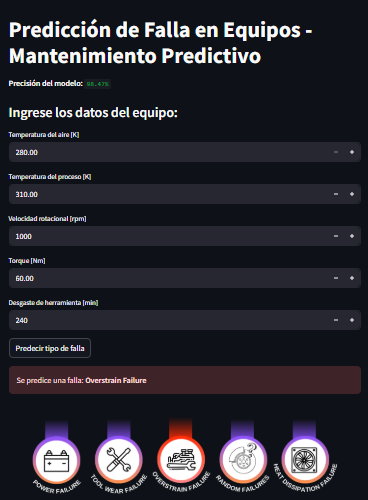

# Predictive-Maintenance-
# Mantenimiento Predictivo con Machine Learning

Este proyecto utiliza un modelo de aprendizaje automático para predecir posibles fallas en equipos industriales a partir de datos de sensores. La aplicación está construida con **Streamlit** y permite ingresar variables del proceso en tiempo real para predecir el tipo de falla que podría ocurrir.

## Descripción

La aplicación entrena un modelo de clasificación usando `RandomForestClassifier` para detectar diferentes tipos de fallas en maquinaria, como:

- **Power Failure** (Falla eléctrica)  
- **Tool Wear Failure** (Desgaste de herramienta)  
- **Overstrain Failure** (Sobreesfuerzo)  
- **Heat Dissipation Failure** (Falla térmica)  
- **Random Failures** (Falla aleatoria)  
- **No Failure** (Sin falla)  

## ¿Cómo funciona?

1. El modelo es entrenado con un dataset de mantenimiento predictivo (`predictive_maintenance.csv`).
2. Se ingresan variables de entrada como temperatura, torque y desgaste de herramienta.
3. El modelo predice el tipo de falla más probable.

   <br>



## Tecnologías utilizadas

- [Python](https://www.python.org/)
- [Pandas](https://pandas.pydata.org/)
- [Scikit-learn](https://scikit-learn.org/)
- [Streamlit](https://streamlit.io/)

##Cómo ejecutar la aplicación

### 1. Instala las dependencias

```bash
pip install streamlit pandas scikit-learn
